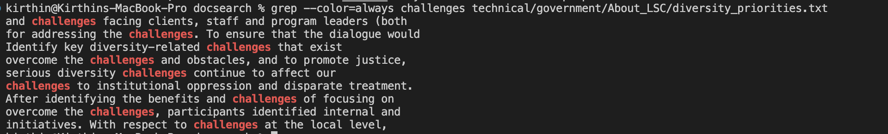

# Lab Report 3: `grep` Command-Line Options


## 1. `-c`
- **Example 1:** Here we are finding how many times the word "Creative" pops up in this text file.  
```
kirthin@Kirthins-MacBook-Pro docsearch % grep -c Creative technical/plos/journal.pbio.0020047.txt
2
```
- **Example 2:** Here we are finding how many times the word "tower" pops up in this text file. 
```
kirthin@Kirthins-MacBook-Pro docsearch % grep -c tower technical/911report/chapter-9.txt        
38
```
- **Example 3:** Here we are finding how many times the word "cell" pops up in this text file. 
```
kirthin@Kirthins-MacBook-Pro docsearch % grep -c cell technical/biomed/1471-213X-3-4.txt   
114
```

## 2. `grep -v`
- **Example 1:** Here we are outputing the text file and omitting any line that contains the substring "subject". 
```
kirthin@Kirthins-MacBook-Pro docsearch % grep -v subject technical/government/Media/5_Legal_Groups.txt


5 Legal Groups at 1 Locale To Serve the February 3, 2002
Vulnerable
Salt Lake City Tribune

BY EDWARD MCDONOUGH
Five independent Salt Lake organizations that provide legal
services to the poor, ethnic minorities, seniors and people with
disabilities have joined together to acquire a west-side downtown
building where they will have their offices. The new Community
Legal Center at 205 N. 400 West is a project of "And Justice for
All," which, until this venture, has been a joint fund-raising
campaign by an alliance of the non-profit providers of free legal
services. "And Justice for All," which solicits donations primarily
from Utah lawyers and foundations, was the first joint fund-raising
campaign of legal services agencies in the country, and the
Community Legal Center is the first joint office project of public
service law groups.
The Legal Aid Society of Salt Lake, the Disability Law Center,
the Multi-Cultural Legal Center, the Senior Lawyer Volunteer
Project and Utah Legal Services will share the new facility, and
last Wednesday their board members were given a tour of the
Community Legal Center hosted by staff members of the five
agencies. All of the agencies can share the same reception area and
client waiting room. The building is close in, across the street
from West High and two blocks from the Gateway. It has its own
parking, something that's hard to find downtown and which has been
a problem for staff as well as clients. Owning and sharing the
building and not paying rent times five will save the non-profit
agencies about $375,000 each year. My assistant, Charity
Christenson, pointed out that the shared facility will also be
efficient for those needing legal services. No longer will a woman
desperate for a protective order, for example, have to run all over
town trying to find the right agency.
After the tour, we found Jaye Olafson at the cookies and
brownies reception on the first floor. Jaye and her husband, Erik,
own Tomax Technologies and were the sellers of the building. Jaye
explained how much of the renovation had been merely uncovering
what was already there. The hardwood floors, wooden ceilings and
brick and stone interior walls were all hidden behind coverings and
old paint. She loves the building, and they only moved out because
the business had outgrown the space. So they renovated the old
Sweet Candy Company building for Tomax. The Olafsons are delighted
with the new owners. The building had been like home, she
explained, and so it was important who would be living there. I
noted on the donor list that the couple, through Olafson Group, had
become one of the major supporters of the project.
Stewart Ralphs, the executive director of the Legal Aid Society,
explained that the Community Legal Center Campaign still has a long
ways to go, with a bit more than half of the $4 million projected
cost received so far. There still needed to be furnishings and
office equipment and such. He promised that they would be getting
```
- **Example 2:** Here we are outputing the text file and omitting any line that contains the substring "the".
```
kirthin@Kirthins-MacBook-Pro docsearch % grep -v the technical/biomed/1471-213X-3-4.txt

  
    
      
        Background
        mesenchymal cells condense at specific sites and
        undergo an ordered differentiation program [ 2 ] (also
        hypertrophy and matrix calcification. The calcified
        osteoblasts and osteoclasts, and bone is formed. Each step
        of cartilage maturation occurs in a precise and tightly
        regulated manner [ 4 ] . Disruptions of this process cause
        abnormalities in cartilage and bone formation [ 5 6 ] .
        Endochondral ossification occurs in embryonic skeletal
        formation, in skeletal growth and fracture healing.
        patterning of skeletal elements [ 7 ] . The functional role
        of Hox genes in skeletal growth and development has been
        differentiation of specific tissues is not well understood.
        expression of yet unidentified target genes [ 8 ] . In
        order to identify such target genes and to better
        differentiation and maturation, we established 
        in vitro culture systems for primary
        mouse rib chondrocytes.
        Previously, we generated transgenic mice that
        thoracic region, where Hoxc-8 is normally expressed ( [ 1 ]
        and unpublished results). The transgenic mice exhibit
        profound cartilage defects, predominantly in ribs and
        vertebral column, and severity of defects depends on
        transgene dosage. The abnormal cartilage is characterized
        by an accumulation of proliferating chondrocytes and
        reduced cartilage maturation. The structural rigidity of
        rib cartilage is greatly compromised, fatally interfering
        with pulmonary function, and vertebral cartilage is so weak
        preparation [ 1 ] . These results suggest that Hoxc-8
        continues to regulate skeletal development well beyond
        pattern formation in a tissue-specific manner, presumably
        chondrocyte differentiation pathway. We found a similar
        phenotype upon overexpression of Hoxd-4 in our transgenic
        system (Kappen, manuscript in preparation), whereas
        developmental defects [ 1 9 ] . The observation that
        cartilage is affected by misregulation of Hoxc-8 and
        Hoxd-4, but not by a divergent homeobox gene, indicates
        suggests that Hox genes could be involved in human
        envisioned that well-defined 
        in vitro culture systems would allow
        of abnormal chondrocyte differentiation in Hox transgenic
        mice. Detailed knowledge of regulatory mechanisms in
        endochondral ossification will be essential for strategies
        to manipulate chondrocyte proliferation, differentiation
        and maturation in skeletal growth and development,
        osteochondrodysplasias and fracture healing.
        The 
        in vitro chondrocyte culture systems
        we utilized here consisted of high-density cultures of
        primary rib chondrocytes from neonatal mice. The micromass
        environment needed for chondrogenesis, cartilage maturation
        in culture was characterized by morphology and
        extra-cellular matrix (ECM) production. Chondrocyte
        cellular hypertrophy, alkaline phosphase activity and
        expression of Collagen type II and type X. Apoptosis was
        investigated by TUNEL (terminal deoxynucleotidyl
        transferase-mediated deoxyuridine triposphate nick end
        labeling). High density bulk cultures were used to assess
        for cell proliferation and differentiation. Proliferation
        of chondrocytes 
        in vivo was assayed by BrdU
        incorporation, and gene expression was analyzed by
        real-time quantitative PCR.
      
      
        Results
        We previously reported [ 1 ] that Hoxc-8 transgenic mice
        rib cage and vertebral column. The cartilage is
        structurally insufficient and weak, contains fewer
        hypertrophic chondrocytes, displays much reduced staining
        for sulfated proteoglycans, and consists predominantly of
        immature chondrocytes, with a high fraction of
        proliferating cells. These results point to a role of
        Hoxc-8 in regulation of cartilage maturation and
        chondrocyte differentiation. A similar phenotype is found
        in Hoxd-4 transgenic mice ( [ 1 ] and Kappen, manuscript in
        preparation) indicating that Hox transcription factors
        regulate chondrocyte development. To examine this function
        in more detail, we employed a culture system that
        facilitates chondrocyte maturation and cartilage formation,
        in vivo situation [ 11 ] . The
        micromass system has been used extensively for studies of
        cartilage formation from limb mesenchyme [ 10 11 12 13 ]
        and also for culture of chondrocytes in high density [ 14 ]
        maturation.
        As established previously, chondrocytes in micromass
        pathway to hypertrophy [ 14 ] . In cultures of neonatal rib
        shown in Figure 1, histology (Panels A and E) and
        immunohistochemistry for Collagens II and X (Figure 1,
        Panels C, D and G, H) revealed appropriate cellular
        morphology, as well as increase in cell size towards
        hypertrophy (Figure 1, Panels E, G, H), and extracellular
        matrix production (Figure 1, Panel F). BrdU incorporation
        1, Panels J, K), while virtually no dividing cells were
        detected by day 15 (Figure 1, Panel L). The proportion of
        culture (Figure 2, Panel A), reflecting our observation
        conditions. Maximal proliferation was found on days 3 and
        day 15 (see also Figure 1). Concommittant with cartilage
        Phosphotase activity (Figure 2, Panel C). As cells matured
        our micromass cultures (Figure 2, Panel D). Apoptosis, as
        percentage of positive cells increased with time in
        rib chondrocytes behaved in a similar manner as
        chondrocytes 
        chondrocytes from mouse neonates grown in micromass culture
        display cellular differentiation, proliferation, maturation
        program 
        utility of this 
        endochondral ossification.
        Rib chondrocytes from neonatal Hoxc-8 transgenic mice
        Figure 3shows that Hoxc-8 transgenic chondrocytes
        morphologically appeared normal and were able to produce
        Collagens II and X, and sulfated proteoglycans (Panels C,
        G, I, D, H, J and B, F respectively). There was no
        chondrocytes to grow or mature in this system (compare to
        Figure 1, Panels A-H). These data indicate that
        conditions described here. This finding was unexpected in
        despite apparently normal maturation, proliferation of
        accumulation of immature, proliferating chondrocytes in
        cell proliferation in Hoxc-8 transgenic chondrocytes.
        
        In vivo labeling with BrdU was
        chondrocytes in Hoxc-8 transgenic mice. Previously, we [ 1
        cartilages accumulate immature chondrocytes, and we showed
        staining for Proliferating Cell Nuclear Antigen (PCNA). The
        accumulation of proliferating chondrocytes could be
        explained in four different scenarios: ( 
        i ) There is a block in differentiation
        that prevents cells from entering hypertrophy. The
        proportion of hypertrophic cells was indeed reduced in
        Hoxc-8 transgenic mice, but progression to hypertrophy was
        not completely inhibited. ( 
        ii ) There is increased recruitment of
        proposition is difficult to investigate, and no evidence is
        available at this stage. ( 
        iii ) The rate of cell division is
        chondrocytes should be shorter. ( 
        iv ) The cell cycle time of
        possibilities, we analyzed BrdU incorporation into
        chondrocytes in Hoxc-8 transgenic mice 
        in vivo . Multiple sections were
        examined from each embryo and showed incorporation of BrdU
        four hours after labeling. Figure 4shows representative
        incorporation in cartilage structures (Panels A, D). To
        directly compare cell proliferation between embryos of
        different genotype, sections of vertebral centers were
        assessed for BrdU incorporation. Figure 4, Panel E shows
        results from embryos isolated at day 15.75 post coitum. The
        differences in cell number/section of vertebral center
        indicate that individual embryos were more progressed in
        centers with more cells overall. Maturation was consistent
        within a given litter (compare samples 1, 2, to 7, 8 and 5,
        6 to 11, 12, respectively). The fraction of cells positive
        for BrdU incorporation was between 7.8 and 14.4%, with a
        trend towards lower rates of incorporation in
        developmentally older embryos with higher Hoxc-8 transgene
        expression levels (TA/TA TR/+; Figure 4, Panel F). While
        additional measurements at later stages of development
        trend for cartilage development in late pregnancy in Hoxc-8
        unexpected: The phenotype of Hoxc-8 transgenic animals at
        17.5 days (approximately 2 days later than assayed here) is
        characterized by accumulation of proliferating cells.
        BrdU incorporation should be found. However, accumulation
        of proliferating cells can also result from a slow-down of
        incorporation. It is intriguing to note that reduced BrdU
        incorporation is particularly detected in developmentally
        larger number of cells, reflecting a longer duration since
        also be noted that both genotypes assayed here develop
        on subsequent days, or upon longer labeling intervals, even
        lower rates of BrdU incorporation should be detected.
        Quantification of such findings, and 
        in vivo measurements of cell cycle
        duration, however, require pulse-chase experiments [ 18 19
        ] , which involve large numbers of animals and are very
        time-consuming.
        capacity of chondrocytes from Hoxc-8 transgenic mice by
        using 
        in vitro assays. We performed cell
        cycle assays on primary chondrocytes isolated from rib
        cages of transgenic and control neonates. Chondrocytes were
        initially continued to proliferate, and later
        differentiated, with cartilage nodules present by 14 days
        after plating. Figure 5shows representative cultures
        chondrocytes in high density bulk cultures (Figure 5, Panel
        D). From this, we were able to estimate a mean doubling
        time of 17-19 hours. This conforms well to previous
        published measurements for chick limb chondrocytes [ 21 ]
        and rat chondrocytes 
        in vitro [ 22 ] . The linear phase of
        72 hour time point was chosen for analysis of cell cycle
        kinetics of Hoxc-8 transgenic chondrocytes 
        Fluorescence Activated Cell Sorting (FACS) assay using
        chondrocytes from Hoxc-8 transgenic and control mice in
        removed at various timepoints after BrdU incorporation and
        subjected to Flow cytometry. Figure 6(Panels A-E") shows a
        typical result for fibroblasts. The same readout was used
        for cultures of primary rib chondrocytes (Figure 6, Panels
        increases, and this is reflected in a concomitant increase
        content is reduced by half, while overall BrdU
        incorporation increases with every subsequent cell cycle.
        analysis of chondrocyte proliferation.
        Interestingly, when primary chondrocytes from Hoxc-8
        cycle kinetics as chondrocytes from control animals.
        Essentially similar proportions of cells in S phase were
        found in all cultures (Figure 7, Panel B). This was
        (Figure 7, Panel B) which increases with increasing
        transgene dosage [ 1 23 ] . These data indicate that, after
        appropriate time in culture, transgenic chondrocytes were
        Given our inability to distinguish Hoxc-8 transgenic
        differentiation or proliferation, we sought to determine
        which molecular differences exist in our transgenic mice
        maturation [ 1 ] . To this end, we analyzed gene expression
        in freshly isolated primary rib chondrocytes from Hoxc-8
        transgenic animals [ 1 ] . Real-time quantitative PCR was
        performed. As shown in Figure 8, Hoxc-8 expression is
        elevated in Hoxc-8 transgenic mice, as expected [ 23 ] .
        Differences also exist between controls and transgenics in
        expression levels for several genes involved in cartilage
        development. For example, Collagen II expression (splice
        form A) is increased, as is Ihh mRNA, and Bmp-4 and p107
        establish alterations in gene expression upon
        skeleton.
        The biological corollaries of changes in gene expression
        Hoxc-8 transgenic chondrocytes, we found increased
        expression of Collagen II splice form A mRNA [ 24 ] . This
        is consistent with our earlier finding of at least 2-fold
        increased Collagen II mRNA expression by in situ
        hybridization and increased numbers of immature
        chondrocytes in Hoxc-8 transgenic mice [ 1 ] . Sox-5, which
        is normally expressed in proliferating chondrocytes [ 25 26
        ] , is elevated in Hoxc-8 transgenic cells, again
        consistent with accumulation of immature chondrocytes.
        a marker for hypertrophic cells. As fewer hypertrophic
        cells are present in Hoxc-8 transgenics, and cartilage
        maturation is delayed in Hoxc-8transgenic animals [ 1 ] ,
        one would expect to see decreased Collagen X mRNA levels [
        is elevated in transgenic rib chondrocytes. This could be
        prehypertrophic and hypertrophic cells or from ectopic
        activation of Collagen X transcription in proliferating
        remains to be investigated. Interestingly, Collagen X
        expression has been shown to be induced by Bmp-2 [ 28 ] ,
        which is overexpressed in our transgenic mice. Bmp-2
        signaling has a positive effect on chondrocyte
        proliferation [ 29 ] , and can induce Indian hedgehog (Ihh)
        expression in responsive cells [ 30 ] . We find Ihh mRNA
        elevated in Hoxc-8 transgenic chondrocytes (see Figure 8).
        Ihh can induce Bmp expression in proliferating cells,
        rate of progression to hypertrophy [ 32 33 ] , again
        consistent with an accumulation of proliferating cells in
        levels originate from increased expression in cells that
        make Ihh normally (prehypertrophic and hypertrophic
        transcription factors in proliferating cells, remains to be
        investigated. Greater numbers of prehypertrophic cells are
        unlikely to account for elevated expression of
        prehypertrophic cell markers: histological sections from
        Hoxc-8 transgenic animals show no increase in
        prehypertrophic cells [ 1 ] , and PTHrP receptor mRNA
        levels are unchanged in cells from transgenic animals (see
        Figure 8). These data also suggest that PTHrP signaling [
        34 35 36 ] is only moderately affected by overexpression of
        to be decreased, which, if reflected in reduced protein
        cartilage maturation in Hox transgenic animals: As Bmp-4
        was shown to have a positive effect on hypertrophy and
        inhibitory effect on proliferation [ 37 38 ] , decreased
        Bmp-4 expression would be expected to promote chondrocyte
        proliferation. p107 has been shown to be required for exit
        is associated with deregulated proliferation. Also,
        chondrocytes without p107 expression fail to respond to
        inhibitory signals from FGFs [ 41 ] . The relationship to
        elevated Fgf receptor 3 mRNA levels in Hoxc-8 transgenic
        cells, however, remains to be clarified. The same caveat
        applies to elevated expression in Hoxc-8 transgenic cells
        of p130, which is also known to be linked to cell cycle
        expression changes in Hoxc-8 transgenic mice is suggestive
        Hoxc-8 transgenic cartilage.
        chondrocytes from Hoxc-8 transgenic animals display notable
        maturation in a pattern largely consistent with delayed
        chondrocyte maturation 
        in vivo . These results now allow us
        regulated by Hox transcription factors in chondrocytes. It
        is also remarkable, as apparent from our cell culture
        results, that cells with obvious molecular differences
        downstream of Hoxc-8 expression can be modulated to
        resemble a normal chondrocyte phenotype after a few days in
        culture.
      
      
        Discussion
        Our studies of chondrocytes from Hoxc-8 transgenic mice
        reveal several interesting results: 
        in vivo , chondrocytes remain
        relatively immature, with few progressing to hypertrophy in
        accumulation of proliferating chondrocytes suggests that
        in vivo BrdU incorporation assays
        suggested that cell cycle progression of chondrocytes may
        be decreased in transgenic animals with higher Hoxc-8
        transgene expression levels. If fewer immature cells enter
        of chondrocytes upon Hoxc-8 overexpression. This could
        occur through two different mechanisms: ( 
        i ) Hoxc-8 actively recruits cells into
        proliferating state; or ( 
        ii ) Hoxc-8 inhibits a specific step in
        chondrocyte maturation. In order to distinguish between
        assays with well-established parameters for chondrocyte
        differentiation and maturation. Interestingly, chondrocytes
        from Hoxc-8 tansgenic animals behaved undistinguishable
        from control cells under all conditions tested. No
        differences were found in capacity to differentiate in
        micromass (see Figure 3), or in high density cultures (not
        shown), and proliferative indices are comparable (see
        Figure 7), irrespective of transgene dosage. The latter
        after culture initiation, which may allow transgenic cells
        to recover to a normal phenotype. However, we did not
        microscopy or histology. Cellular differences must exist at
        be expected to die as a Hoxc-8 transgenic), and indeed
        phenotype or support normal chondrocyte maturation.
        evidence to support this possibility as Hoxc-8 is expressed
        normally in our chondrocyte cultures (data not shown), and
        cartilage-specific element (Cormier and Kappen, unpublished
        results) that is active in chondrocytes. Yet, even if
        biological effects of at least 6 days of Hoxc-8
        overexpression 
        transgenic mice is mediated by absence of factors/signals
        conditions and supplementation with candidate molecules
        interesting, albeit preliminary, finding from our gene
        expression studies is that chondrocytes from Hoxc-8
        transgenic animals display gene expression profiles that
        are indicative for immature chondrocytes, but not totally
        identical. This suggests that both Hox transcription
        maturation, induce specific changes in gene expression. By
        on microarrays, it may thus be possible to identify
        specific targets for Hox transcription factors in
        chondrocytes.
      
      
        Conclusions
        Hoxc-8 transgenic chondrocytes are capable of reverting to
        a normal cellular phenotype. Thus, Hoxc-8 induced changes
        in chondrocytes are reversible under certain conditions.
        chondrocytes can be modulated by external factors, and this
        interactions as modulators of Hox gene function.
      
      
        Methods
        
          Preparation of mouse rib chondrocytes
          The preparation of primary rib chondrocytes from
          Lefebvre et al. [ 20 ] . Briefly, newborn FVB mice were
          dissected in sterile conditions to release soft tissues.
          Rib cages were transferred to phosphate buffered saline
          (PBS) and washed extensively. Cells were dissociated in
          50 ml tubes by enzymatic digestion with 0.25% Collagenase
          (Worthington Biochemical, Collagenase Type 2 - CLS 2) and
          0.25% Trypsin/EDTA (Invitrogen/Gibco BRL) for 1 hour at
          with PBS, and fresh 0.25% Collagenase in PBS was added
          dissociated. The enzymatic reaction was stopped with an
          equal volume of tissue culture medium containing 10% FCS.
          The cells were filtered through a 70 μm cell strainer
          (Becton Dickinson) and pelleted by centrifugation in 50
          ml conical tubes (maximum volume 25 ml) at 1200 rpm for 5
          minutes. The pellet was washed with PBS, cells were
          counted, and adjusted for desired cell density.
        
        
          Primary chondrocyte high density bulk
          cultures
          For analysis of cell cycle parameters, we kept primary
          chondrocytes in high density bulk cultures, as this
          allows for recovery of cells for flow cytometry. These
          cultures undergo chondrocyte maturation with
          differentiation to hypertrophy and formation of cartilage
          modules. Briefly, cells were plated on 35 mm dishes
          coated with 0.1% gelatin at a final concentration of 3 ×
          10 5/dish, in DMEM, high glucose, 10% FCS and 25 μg/ml
          L-ascorbic acid. Removal of cells was done by
          trypsinization. For Alcian Blue staining, cells were
          which consisted of 15 mg Alcian Blue 8GX (Sigma) in 30 ml
          of 95% Ethanol and 20 ml Glacial acetic acid. Cells were
          rinsed again with 70% Ethanol, and dehydrated through an
        
        
          Primary high density micromass cultures
          For micromass cultures [ 12 ] , cell density was
          adjusted to 25 × 10 6cells/ml. 103 l of cell suspension
          plate, Midwest Scientific). The cultures were incubated
          at 37°C in a humidified incubator with 5% CO 
          2 for 1 1/2 to 2 hours to allow for
          cell adhesion and attachment. Medium was added very
          slowly and consisted of a 1:1 mixture of DMEM and F12
          (Life Technologies/Gibco BRL) supplemented with 10% fetal
          calf serum (Hyclone), 5000 U/ml Penicillin, 53 g/ml
          Streptomycin (Life Technologies/Gibco BRL), 25 μg/ml
          L-ascorbic acid (Life Technologies/Gibco BRL) and 10 mM
          β-Glycerophosphate (Sigma). Medium was replaced with
        
        
          Assessment of morphological and histological
          parameters of micromass cultured cells
          observed directly by phase contrast light microscopy.
          After that, cultures were harvested, washed in PBS, fixed
          in 4% Paraformaldehyde for 45 minutes, dehydrated in
          graded series of Ethanol and paraffin-embedded for
          subsequent analysis. We used histochemical staining with
          Hematoxylin and Eosin to ascertain cell morphology; and
          Alcian Blue at pH 1 [ 43 ] to detect cartilage matrix
          sulfated glucosaminoglycans as described before [ 1 ] .
          The production of Collagen type II was assessed by
          immunohistochemistry using a monoclonal antibody against
          mouse type II Collagen (Chemicon), and secondary antibody
          and colorimetric reaction kit (Histostain Plus, Zymed).
          Cell proliferation was assessed by BrdU incorporation.
          Cells were incubated with 3 mM of BrdU (Sigma), harvested
          after 24 hrs and paraffin-embedded. Cells with BrdU
          incorporation were detected by immunohistochemistry with
          a monoclonal antibody against BrdU (BrdU staining kit,
          Zymed). Cell size was determined by measuring cell
          diameter microscopically, and mean cell size was
          calculated. Alkaline phosphatase activity was measured as
          follows: Cells were rinsed in cold TBS (Tris-buffered
          was centrifuged at 1200 rpm for 5 minutes at 4°C. Protein
          BCA assay (Pierce Chemicals). Alkaline phosphatase
          p-nitrophenyl phosphate (ALP10, Sigma). Type X Collagen
          deposition in extracellular matrix was analyzed by
          immunohistchemistry using a monoclonal antibody against
          mouse type X Collagen (Research Diagnostics, Inc.) and
          was assessed by terminal deoxynucleotidyl
          transferase-mediated deoxyuridine triphosphate (dUTP)
          nick end labeling (TUNEL) (In situ Cell Death Detection
          Kit, POD, Boehringer-Manheim).
        
        
          Transgenic mice
          1 ] . Briefly, Hoxc-8 expressing mice are generated in a
          binary transgenic mouse system [ 44 ] by crossing a
          transactivator strain (harboring a transgene in which
          Hoxc-8 transresponder transgene is activated, and Hoxc-8
          becomes overexpressed [ 23 ] . This system also allows
          dosage by superimposition of transgene loci to
          transresponder strains. All procedures involving animals
          Care and Use Committee at UNMC.
          transresponder strain [ 1 ] . Maintenance and genotyping
          of transgenic mice was done as described before [ 1 23 ]
          from animals hemizygous for both transgenes.
          All transgenes were maintained on a homogenous FVB
          inbred genetic background, and normal FVB mice were used
        
        
          In vivo BrdU incorporation
          To assess chondrocyte proliferation in Hoxc-8
          transgenic mice, we performed 
          in vivo BrdU labeling experiments.
          BrdU labeling reagent (Amersham RPN202) in PBS was
          injected into pregnant females at 0.01 ml/gr body weight.
          Four hours later, dams were sacrificed, embryos were
          isolated and fixed in 4% paraformaldehyde overnight at
          and embedded in paraffin for histological sectioning.
          Sections of 10 μm thickness were rehydrated and incubated
          for 10 minutes with one part 30% H 
          2 O 
          2 : 9 parts MeOH and processed in HIER
          (Biotek Solutions), denaturing and blocking solutions
          BrdU staining kit with Horseradish Peroxidase, and
          development with DAB for 5 minutes. Counterstaining was
          done with Hematoxylin for one minute. Sections of
          vertebral structures were matched between pairs of
          skeletal structures were counted from at least 5 (samples
          slides for each animal and cell counting was done
          independently by two technologists without knowledge of
          sample genotype. Data were collected from three
          independent experiments and were averaged to
          cells/section to normalize for potential growth
          differences between litters. Exponential trendlines were
          added by regression analysis as implemented in Microsoft
          Excel.
        
        
          Assessment of cell proliferation in vitro by BrdU
          incorporation and flow cytometry
          Primary rib chondrocytes were prepared as described
          above and 3 × 10 5cells/well were placed into culture in
          6-well plates. Medium was changed daily. Proliferation
          was assessed by cell counting, and maturation was
          ascertained visually as cartilage nodule formation, and
          histochemically by Alcian Blue staining. Cell cycle
          kinetics were measured by BrdU incorporation and flow
          cytometry for DNA content at various time points after
          incubated with any reagents or cells that were exposed
          only to anti-BrdU antibody and Propidium Iodide served as
          controls. For BrdU incorporation studies, BrdU labeling
          reagent (Amersham) was diluted 1:1000 in medium to a
          final concentration of 10 μM BrdU and 1 μM FdU, and
          sterilized through a 0.22 μm filter. 2 ml of staining
          solution were added to each well of a 6-well plate,
          followed by incubation for 0, 6, 12, 18, or 24 hours as
          PBS, and 2 ml Trypsin-EDTA (Gibco/BRL) was added for at
          least five minutes at 37°C. The reaction was inactivated
          by an equal volume of serum-containing medium, and after
          vigorous pipetting, cells were collected into Falcon 2052
          (12 × 75 mm, Becton-Dickinson) tubes. Cells were pelleted
          setting 4. Cells were washed with 1% BSA/PBS and
          repelleted. During cell resuspension, 1 ml ice-cold 70%
          -20°C for up to three days, or processed after 20 minute
          fixation by repelleting. Resuspension was done in 1 ml 2
          N HCl/0.5% Triton X-100, and samples were incubated for
          30 minutes at room temperature with vortexing every five
          supernatant, nuclei were resuspended in 1 ml 0.1 M Na 
          2 B 
          4 O 
          7 (pH 8.5) for two minutes at room
          temperature, and washed with 1 ml 0.5% Tween-20/1%
          BSA/PBS. Then, 20 μl FITC-coupled anti-BrdU antibody
          (Becton-Dickinson) was added, followed by 30 minute
          wash with 1 ml 0.5% Tween-20/1% BSA/PBS, nuclei were
          resuspended in 0.25 ml PBS containing 5 μg/ml Propidium
          Iodide, filtered through 1.2 ml Costar cluster tubes
          (Costar #4410), or 6 ml tubes with 35 μm strainer cap
          (Falcon 2235, Becton-Dickinson) in case of volumes
          greater than 0.5 ml. Flow cytometry was done on a FACScan
          (Becton-Dickinson) and results were analyzed using FlowJo
          software (TreeStar).
        
        
          Gene expression studies
          To measure gene expression quantitatively, RNA was
          extracted from primary rib chondrocytes as follows: cells
          were harvested as described above, rinsed in PBS and kept
          in Trizol at -80°C. Extracts were thawed, homogenized in
          a PowerGen 125 homogenizer for 1 minute, centrifuged at
          2000 rpm for 30 seconds. The supernatant was transferred
          to fresh tubes, 20% of volume of chloroform was added,
          centrifugation at 12000 rpm for 5 minutes at 4°C. The top
          layer was removed to fresh tubes for precipitation with
          0.5 ml Isopropyl Alcohol, and centrifuged at 12000 rpm
          for 10 minutes at 4°C. The supernatant was removed and
          for 1-2 minutes and dissolved in nanopure H 
          2 O by gentle pipetting and, where
          necessary, by incubation at 37°C for 10 minutes. RNA
          concentration was measured by spectrophotometry. Reverse
          cDNA concentration was measured by spectrophotometry.
          Primers for amplification were designed using Primer
          requirements: min. TM 58°C, max. TM 60°C, optimal TM
          59°C; GC content requirements: min. % GC 20, max.% GC 80;
          length requirements: min. length 9, max length 40,
          optimal length 20; amplicon requirements: min. TM 0°C,
          max. TM 85°C, min. length 50, max. length 150. The
          following primer pairs (Genbank accession numbers and
          Bcl-2 (NM_009741); forward primer:
          5'-CGGAGACGAGTTCAACGAAAC-3'(681-701); reverse primer:
          5'-TGTAAGATAACCATTTGAGGGTGG-3'(770-747).
          Bone Morphogenetic Protein-2 (Bmp-2; NM_007553);
          forward primer: 5'-CCTCAAGTCCAGCTGCAAGAG-3'(1223-1243);
          reverse primer:
          5'-GGTGCCACGATCCAGTCATT-3'(1300-1281).
          Bone Morphogenetic Protein-4 (Bmp-4; D14814); forward
          primer: 5'-GCACTGCCGCAGCTTCTC-3'(5630-5647); reverse
          primer:
          5'-CACTGACAGAAAACAAGGCATATAATAA-3'(5727-5700).
          Collagen II splice form A (NM_001844); forward primer:
          5'-AATGGGCAGAGGTATAAAGATAAGGA-3'(24-49); reverse primer:
          5'-CATTCCCAGTGTCACACACACA-3'(99-78).
          Collagen X (X67348); forward primer:
          5'-CAAACGGCCTCTACTCCTCTGA-3'(1937-1958); reverse primer:
          5'-CGATGGAATTGGGTGGAAAG-3'(2065-2046).
          Dlx 5 (NM_01156); forward primer:
          5'-ACGCGCGGAGTTGGC-3'(437-451); reverse primer:
          5'-CTTGATCTTGGATCTTTTGTTCTGAA-3'(518-493)
          Fibroblast growth factor receptor 3 (Fgfr3;
          NM_008010); forward primer:
          5'-GAGTCTACACCCACCAGAGTGATGT-3'(2200-2224); reverse
          primer: 5'-AGCCCCCCAGCGTAAAGAT-3'(2271-2253).
          Glyceraldehyde 3-phosphate dehydrogenase (GAPDH;
          Xm_194302) forward primer:
          5'-CCAGAACATCATCCCTGCATC-3'(674-694); reverse primer:
          5'-GGTAGGAACACGGAAGGCC-3'(794-776)
          Hoxc-8 (NM_010466); forward primer:
          5'-CAACACTAACAGTAGCGAAGGACAAG-3' (595-620); reverse
          primer: 5'-CAAGGTCTGATACCGGCTGTAAGT-3' (727-704).
          Indian hedgehog (Ihh; U85610); forward primer:
          5'-CCCCAACTACAATCCCGACA-3'(543-562); reverse primer:
          5'-TCATGAGGCGGTCGGC-3'(607-592).
          p107 (U27177); forward primer:
          5'-TGGATTATTGAAGTTCTCGATTTGC-3'(1624-1648); reverse
          primer: 5'-ATGCTGTTCAGATGTTTCACCATG-3'(1736-1713)
          Parathyroid Hormone/Parathyroid hormone related
          peptide Receptor (PTH/PTHrP-R; L28108); forward primer:
          5'-GAAAGAATAAAGCAAAAGCGAGACA-3'(232-256); reverse primer:
          5'-AGGGAGCTCTGACATCGGG-3'(299-281).
          Sox-5 (NM 011444); forward primer:
          5'-ATGGTGTGGGCGAAAGATGA-3'(1802-1821); reverse primer:
          5'-GGCGGGCCTGCTCCT-3'(1946-1932).
          All real-time PCR reactions were performed in
          triplicate on an ABI Prism 7000 in SYBR Green Master Mix
          (Applied Biosystems), with denaturation at 94°C for 15
          seconds, annealing at 55°C for one minute and extension
          at 60°C for one minute in a total of 40 cycles. 100 nM of
          each primer were used and 10 ng of template cDNA.
          Measurements were done in triplicate for each sample, and
          which signal above threshold was detected. The values
          were averaged and standardized to measurements for GAPDH
          GENE - Ct 
          GAPDH = ΔCt. This value for each gene
          subtraction: ΔCt 
          transgenic - ΔCt 
          control = ΔΔCt. The value for "fold
          formula f = 2 ΔΔCt. The resulting data were expressed as
        
      
    
  
```
- **Example 3:** Here we are outputing the text file and omitting any line that contains the substring "The".
```
kirthin@Kirthins-MacBook-Pro docsearch % grep -v The technical/plos/journal.pbio.0020047.txt 

  
    
      
        
        Creative human beings are the torch-bearers of civilization. How does their creativity
        arise? What causes some minds/brains to achieve awe-inspiring artistic or scientific
        achievements? We cannot help but be fascinated by the fact that Shakespeare—a merchant's
        son with “small Latin and less Greek”—could emerge from the “nowhere” of rural Stratford to
        create the richest literary treasure in the English language. We wonder how Michelangelo—a
        stonecutter's son who also came from a rural nowhere—found within himself the vision to see
        the shape of David in a block of discarded marble or the apolcalyptic fresco of 
        influences shaped their brains to create—and to create these very specific wondrous things?
        How did their environments promote or impede them? Would Michelangelo have been great
        without the patronage of the Medicis or the competitive edge induced by Leonardo? Great art
        and great science are indeed often forged in the smithy of pain—with the fire fueled by
        self-doubt, obsessive preoccupation, sorrow, depression, competition, or economic
        needs.
        
        Brain by Alice Weaver Flaherty unites two intrinsically fascinating domains of
        knowledge—the workings of the brain and the nature of creativity. Its author, a neurologist
        who has also become a writer by virtue of having published her first nonacademic book,
        draws on her knowledge of neuroscience, her medical career as a clinician, and her
        experiences as a patient. Early in the book, she describes her own hospitalization for
        manic-depressive illness, a disclosure that implicitly places her in the pantheon of other
        artists who have suffered from serious mental illness and provides her with
        to us in the first person, but one is not quite sure which person (the neuroscientist, the
        doctor, or the patient) is actually speaking. In other words, this book has a jarring lack
        of a strong single voice, despite a knack for often finding a fine turn-of-phrase or a
        clever word choice.
        Given that the book topic is promising and that the author can often write very well, it
        is dismaying that this book is not better than it is. It is written for the intelligent lay
        public, many of whom avidly collect and read “brain books” to expand their minds. Most
        painful is the fact that this book is filled with factual errors, glib and misleading
        generalizations, and careless misstatements. Perhaps most shocking and most erroneous, we
        much changing a person's behavior.” HM, the most famous patient to receive bilateral
        temporal lobectomy, remains frozen in a past linked to a never-changing present because he
        lost the capacity to retain new memories. Temporal lobe syndromes are discussed more
        accurately later in the book, but that is a weak excuse for this early error.
        We are also told that “manic depression is a genetically transmitted syndrome” (when, in
        fact, no replicable genetic loci have yet been identified), that “a very high proportion of
        manic depressives become writers” (the lifetime prevalence rate of bipolar disorder is
        approximately 1%, and only a tiny proportion of that 1% are writers), and that
        “electrophysiology, because it is dangerous, is rarely performed” (electrophysiology
        tools—e.g., the study of evoked potentials or electroencephalograms—are noninvasive and
        frequently used; recordings of the activity of individual neurons with electrodes placed in
        the gray matter are indeed rare, but nothing from the context suggests that this particular
        many thoughtful people for more than two millennia. What is the nature of creativity? What
        is the difference between skill and creativity? What is the relation between mental illness
        and creativity? Is creativity inhibited when mental illnesses are treated? What is the
        on these questions. Its focus is the domain of writing, drawing from the author's own
        experience of a compulsion to write, or hypergraphia, following a pyschic break. What is
        the relationship between hypergraphia and the brain? Between writer's block and the brain?
        Are these problems always pathological, or do they sometimes enhance creativity? Does that
        college student who can't finish a term paper have a “disease”? Can “mind-expanding” drugs
        that affect the brain enhance creativity?
        In short, 
        about the nature of creativity, its origins in the mind/brain and in the human genome, and
        its boundaries with health and disease.
      
    
  
```

## 3. `grep --color=always`

- **Example 1:** Here we are highligthing/coloring and only inclduing lines that contain the substring "result".

```
kirthin@Kirthins-MacBook-Pro docsearch % grep --color=always results technical/biomed/1468-6708-3-7.txt
        of CHF results from a harmful effect of doxazosin, a
        tolerability. In light of the results of ALLHAT, we
          shown similar results (Table 1). Patients treated with
        was published in April, 2000. At that time, the results of
        failure findings in ALLHAT, the results support the current
```


- **Example 2:** Here we are highligthing/coloring and only inclduing lines that contain the substring "terrorism".


```
kirthin@Kirthins-MacBook-Pro docsearch % grep --color=always terrorism technical/911report/chapter-2.txt
                terrorism and of attacks on civilians, he replied:"We believe that the worst thieves
                terrorism, without the need for the Islamic Army Shura. Bin Ladin was prepared to
```


- **Example 3:** Here we are highligthing/coloring and only inclduing lines that contain the substring "challenges".


```
kirthin@Kirthins-MacBook-Pro docsearch % grep --color=always challenges technical/government/About_LSC/diversity_priorities.txt 
and challenges facing clients, staff and program leaders (both
for addressing the challenges. To ensure that the dialogue would
Identify key diversity-related challenges that exist
overcome the challenges and obstacles, and to promote justice,
serious diversity challenges continue to affect our
challenges to institutional oppression and disparate treatment.
After identifying the benefits and challenges of focusing on
overcome the challenges, participants identified internal and
initiatives. With respect to challenges at the local level,
```

