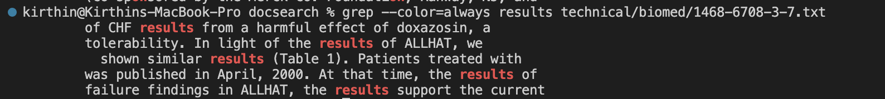
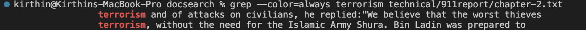

# Lab Report 3: `grep` Command-Line Options


## 1. `-m NUM`
| Examples      | Code |
| ----------- | ----------- |
| Example 1    | Title       |
| Example 2  | Text        |
| Example 3 | Text |

## 2. `-c`
| Examples      | Code |
| ----------- | ----------- |
| Example 1    | Title       |
| Example 2  | Text        |
| Example 3 | Text |

## 3. `grep --color=always`
- **Example 1**
```
kirthin@Kirthins-MacBook-Pro docsearch % grep --color=always results technical/biomed/1468-6708-3-7.txt
        of CHF results from a harmful effect of doxazosin, a
        tolerability. In light of the results of ALLHAT, we
          shown similar results (Table 1). Patients treated with
        was published in April, 2000. At that time, the results of
        failure findings in ALLHAT, the results support the current
```


- **Example 2**
```
kirthin@Kirthins-MacBook-Pro docsearch % grep --color=always terrorism technical/911report/chapter-2.txt
                terrorism and of attacks on civilians, he replied:"We believe that the worst thieves
                terrorism, without the need for the Islamic Army Shura. Bin Ladin was prepared to
```


- **Example 3**
```
kirthin@Kirthins-MacBook-Pro docsearch % grep --color=always challenges technical/government/About_LSC/diversity_priorities.txt 
and challenges facing clients, staff and program leaders (both
for addressing the challenges. To ensure that the dialogue would
Identify key diversity-related challenges that exist
overcome the challenges and obstacles, and to promote justice,
serious diversity challenges continue to affect our
challenges to institutional oppression and disparate treatment.
After identifying the benefits and challenges of focusing on
overcome the challenges, participants identified internal and
initiatives. With respect to challenges at the local level,
```

